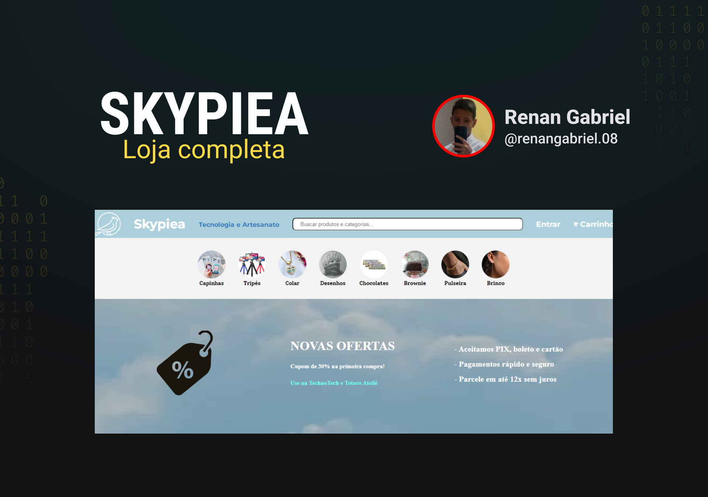

<h1 align="center"> SKYPIEA </h1>

Projeto Front-End de um site de uma loja, que surge a partir da parceria entrea outras quatro, para que os clientes tenham tudo que precisam em um só lugar.

  <a href="#-tecnologias">Tecnologias</a>&nbsp;&nbsp;&nbsp;|&nbsp;&nbsp;&nbsp;
  <a href="#-projeto">Projeto</a>&nbsp;&nbsp;&nbsp;|&nbsp;&nbsp;&nbsp;
  <a href="#-layout">Layout</a>&nbsp;&nbsp;&nbsp;|&nbsp;&nbsp;&nbsp;
  <a href="#memo-licença">Licença</a>

  

 

  

## 🚀 Tecnologias

Esse projeto foi desenvolvido com as seguintes tecnologias:

- HTML e CSS
- Git e Github

## 💻 Projeto

Skypiea é um site de uma loja, que surge a partir da parceria entrea outras quatro, para que os clientes tenham tudo que precisam em um só lugar.

## 🔖 Layout

Você pode visualizar o layout inicial do projeto através [DESSE LINK](https://www.figma.com/file/JxXsAN4HeQnAO65K7XSYmD/Skypiea?node-id=0%3A1&t=St2tQWINH8MyiUGA-1). É necessário ter conta no [Figma](https://figma.com) para acessá-lo.

## :memo: Licença

Esse projeto está sob a licença MIT.

---

- Código desenvolvido por Renan :wave: [LinkedIn](https://www.linkedin.com/in/renan-gabriel/) | [Github](https://github.com/renangabriel08)
- Figma desenvolvido pela Caroline :wave: [LinkedIn](https://www.linkedin.com/in/caroline-moreno-alves-bettini-299311249/) | [Github](https://github.com/caroline-moreno)